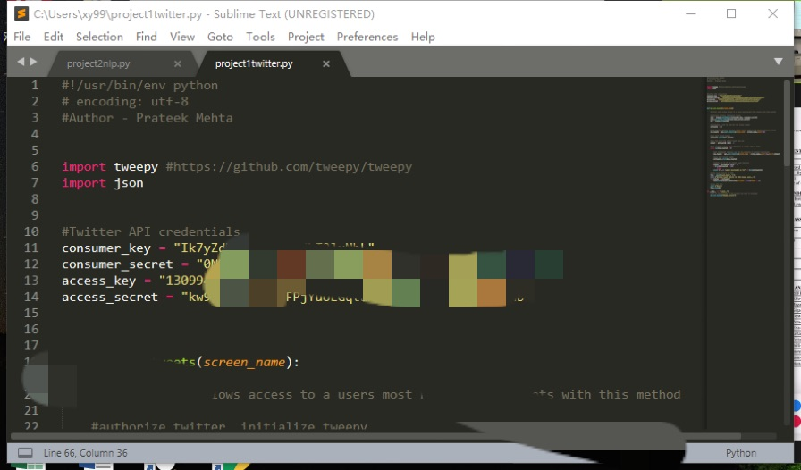

# EC601project2twitterapi
I've applied for a twitter account with my bu email.When I applied for API access,it asked me to answer some questions about applying twitter API. I answered all of them but my request was denied. So I borrowed my teammate Runyu Wang's account to finish this project. 
First, we need to install searchtweets library: pip install searchtweets.
Then, install tweepy:pip install tweepy.
I use the twitterAPI example showed in the google doc.
Then I used my teammate Runyu's account.Pasted the Customer Key, Customer Secret, Access key, and Access Secret on Twitter API website.

  
Since I want to get all tweets of a NBA star. I used get_all_tweets("@Dame_Lillard")
Then I get a .jason file which include all the informations.

